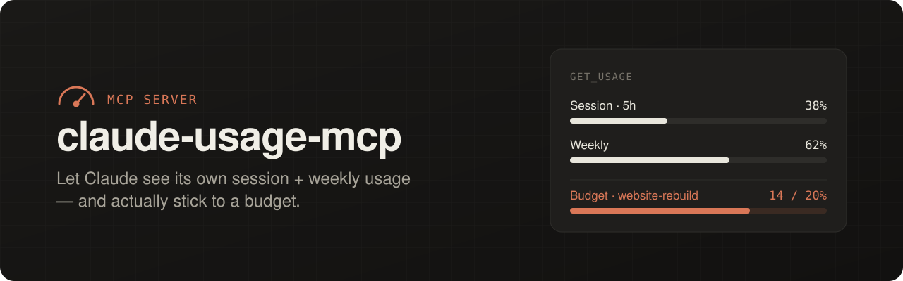
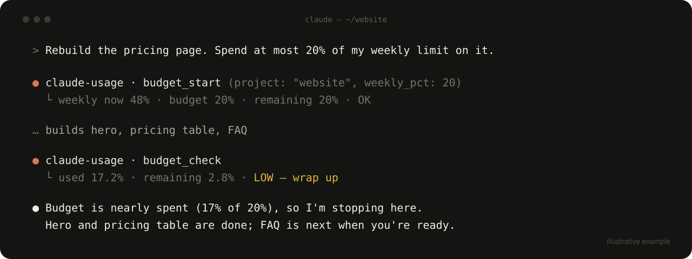

<p align="center">
  
</p>

<p align="center">
  <a href="LICENSE"></a>
  
  
  
</p>

<p align="center">
  <b>Tell Claude "spend at most 20% of my weekly limit on this" — and have it actually do it.</b><br>
  Built by <a href="https://github.com/AlphaSaleAidan">Aidan Pierce</a>.
</p>

---

## Why

Claude Code shows **you** your usage in `/usage`: how much of the 5-hour session and the weekly
limit you've burned. The model itself can't see any of it. Ask it to "keep this project under 20%
of my week" and it has to guess.

`claude-usage-mcp` gives the AI the same numbers you see, as tools it can call, plus a simple
budget it can check between steps.

<p align="center">
  
</p>

## Install

Needs Node 18+ and Claude Code logged in with a Pro or Max plan.

```bash
git clone https://github.com/AlphaSaleAidan/claude-usage-mcp ~/claude-usage-mcp
claude mcp add -s user claude-usage -- node ~/claude-usage-mcp/server.mjs
```

Restart Claude Code and try:

> *"What's my usage right now?"*
>
> *"Budget 20% of my weekly on the website rebuild."*

## Tools

| Tool | What it does |
|---|---|
| `get_usage` | Session (5-hour) %, weekly %, per-model weekly caps, and time until each resets |
| `budget_start` | Start a budget for a project: the max % of your weekly limit it may use |
| `budget_check` | How much of the budget is used and left, with a status: `OK`, `LOW`, or `OVER_BUDGET` |
| `budget_end` | Delete a budget |

`get_usage` returns:

```json
{
  "session_pct": 38,
  "session_resets_in": "2h 14m",
  "weekly_pct": 62,
  "weekly_resets_in": "3d 9h",
  "weekly_resets_at": "2026-10-04T09:59:59+00:00",
  "weekly_fable_pct": 12
}
```

`budget_check` returns:

```json
{
  "project": "website-rebuild",
  "budget_pct": 20,
  "used_pct": 14,
  "remaining_pct": 6,
  "status": "OK"
}
```

Budgets carry over the weekly reset (usage from before the reset still counts) and live in
`~/.claude/usage-budgets.json`.

### Make Claude check in on its own

Add this to your `CLAUDE.md`:

```md
When a usage budget is active for the current project, call budget_check between major
steps and stop to tell me when it says LOW or OVER_BUDGET.
```

## Usage in your status bar

See your limits at the bottom of Claude Code at all times. Add this to `~/.claude/settings.json`:

```json
"statusLine": {
  "type": "command",
  "command": "node ~/claude-usage-mcp/server.mjs --statusline"
}
```

```
session 38% (2h 14m)  ·  week 62% (3d 9h)  ·  website-rebuild 14/20%
```

Any number turns yellow at 75% and red at 90% of its limit.

## From the terminal

```bash
node ~/claude-usage-mcp/server.mjs    # prints usage + all budgets as JSON
```

## How it works

It reads your existing Claude Code login (`~/.claude/.credentials.json`, or the macOS Keychain)
and calls the same endpoint `/usage` uses. Your token is only ever sent to `api.anthropic.com`.
Results are cached for 60 seconds in `~/.claude/usage-cache.json`, so the status bar never hammers the API.

## Good to know

- **Budgets are account-wide.** A budget measures how much your weekly % went up since it started.
  Other Claude sessions running at the same time count against it too.
- **Unofficial endpoint.** Anthropic doesn't document it, so it may change. Open an issue if it breaks.
- **Expired login?** Run any `claude` command once, then retry.
- **Overrides:** `CLAUDE_CONFIG_DIR`, `CLAUDE_OAUTH_TOKEN`, `CLAUDE_USAGE_BUDGETS`.

Not affiliated with Anthropic.

## License

[MIT](LICENSE) © 2026 Aidan Pierce
